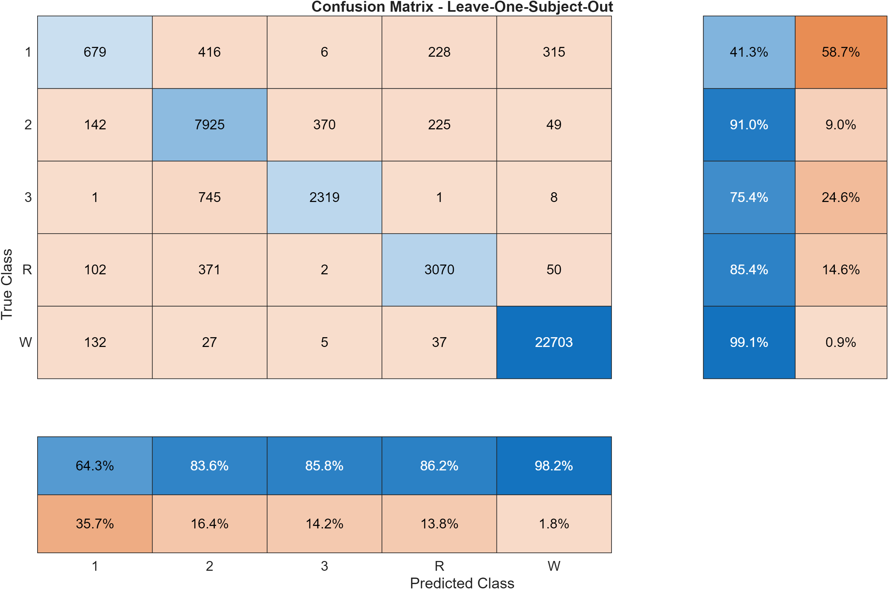

# Automated Sleep Stage Classification via Multi-Modal Biosignal Analysis

## Project Overview
This project implements a complete machine learning pipeline in MATLAB to classify sleep stages from polysomnography (PSG) data. Using the **Sleep-EDF dataset**, the system processes EEG, EOG and EMG signals to identify sleep stages (Wake, REM, N1, N2, and N3).

The model achieves a **mean accuracy of ~92%** using a robust **Leave-One-Subject-Out (LOSO)** validation framework. This project was developed to demonstrate advanced proficiency in medical signal processing and subject-independent machine learning, applying engineering principles to real-world clinical data.

## Data Source & Preparation
The signals used in this project are obtained from the [Sleep-EDF Database Expanded](https://physionet.org/content/sleep-edfx/1.0.0/) on PhysioNet.

To run the pipeline, the EDF files must be placed in a folder named `Dataset/` and renamed according to the following convention:
* **`#-PSG.edf`**: The raw signal recordings (where `#` is the number of the subject).
* **`#-H.edf`**: The hypnogram files containing manual annotations by medical experts.

## Key Features
* **Signal Processing**: Implementation of 4th-order Butterworth bandpass filters for EEG (0.3–35 Hz) and EOG (0.05–15 Hz).
* **Multi-Modal Feature Extraction**:
    * **EEG**: Spectral band powers (Delta, Theta, Alpha, Sigma, Beta) and ratios (e.g., Theta/Alpha, Sigma/Delta).
    * **EOG**: Statistical time-domain features (RMS, Zero Crossing Rate) and Hjorth Parameters (Mobility, Complexity).
    * **EMG**: Muscle activity tracking via mean, standard deviation, and signal slope.
* **Temporal Context**: Enhanced classification by incorporating features from preceding and succeeding 30-second epochs.
* **Feature Selection**: Automated dimensionality reduction using a correlation-based mask ($R > 0.9$) to ensure model parsimony.
* **LOSO Validation**: Rigorous testing where the model is trained on $N-1$ subjects and tested on the $N^{th}$ subject to ensure real-world clinical generalizability.

## Requirements
This project requires **MATLAB** (recommended version R2022b or later) and the following toolboxes:
* **Signal Processing Toolbox**: For digital filtering and spectral analysis.
* **Statistics and Machine Learning Toolbox**: For ensemble classification and model validation.

## Repository Structure
* `getSignals.m`: Handles EDF loading and 30s epoching.
* `getSignalsTable.m`: It processes raw signals for each patient and saves subject-specific `.mat` files containing the complete feature tables and corresponding labels.
* `butterworth.m`: Implements a 4th-order Butterworth bandpass filter to remove noise and isolate relevant physiological frequency bands (EEG: 0.3–35 Hz, EOG: 0.05–15 Hz).
* `transform.m`: Computes the Fast Fourier Transform (FFT) to convert segmented time-domain signals into the frequency domain for spectral analysis.
* `extractEEGfeatures.m` / `extractEOGfeatures.m` / `extractEMGfeatures.m`: Domain-specific feature engineering.
* `addTemporalContext.m`: Function to append data from neighboring epochs for sequence awareness.
* `featuresCorrelation.m`: Statistical analysis to remove redundant features.
* `main.m`: Implements the Leave-One-Subject-Out cross-validation and Random Forest training.

## Results

* **Overall Accuracy**: ~92%
* **Performance Analysis**: The model demonstrates high reliability in detecting intermediate sleep (N2), REM stage (R) and Wakefulness (W). Consistent with established clinical challenges, the primary source of error is Stage N1 classification. This is attributed to two main factors:
    1. **Transitional Nature**: N1 represents a highly variable transition state between wakefulness and light sleep, often lacking distinct electrographic boundaries.
    2. **Class Imbalance**: In the Sleep-EDF dataset, N1 is significantly underrepresented compared to other stages (e.g., N2 or Wake). This scarcity of training examples limits the model's ability to learn robust patterns for this specific stage.

  

## How to Use
1.  Place the Sleep-EDF `.edf` files in a folder named `Dataset/`.
2.  Run `getSignalsTable.m` to extract features and save subject-specific `.mat` files.
3.  Run `featuresCorrelation.m` to generate the `feature_mask.mat`.
4.  Execute `main.m` to perform the training and generate the final confusion matrix.

## Future Improvements

- Include more subjects and fine-tune hyperparameters
- Compare different classifiers (SVM, LSTM)
- Add automatic artifact detection and rejection
- Integrate feature selection to reduce dimensionality

## Author

**Simone Tovo**  
University of Padova — MSc in Bioengineering  
simonetovo77@gmail.com

Focus areas: **Neuroengineering**, **Signal Processing**, **Machine Learning**

## License

This project is released under the **MIT License**, allowing open use and modification with attribution.
